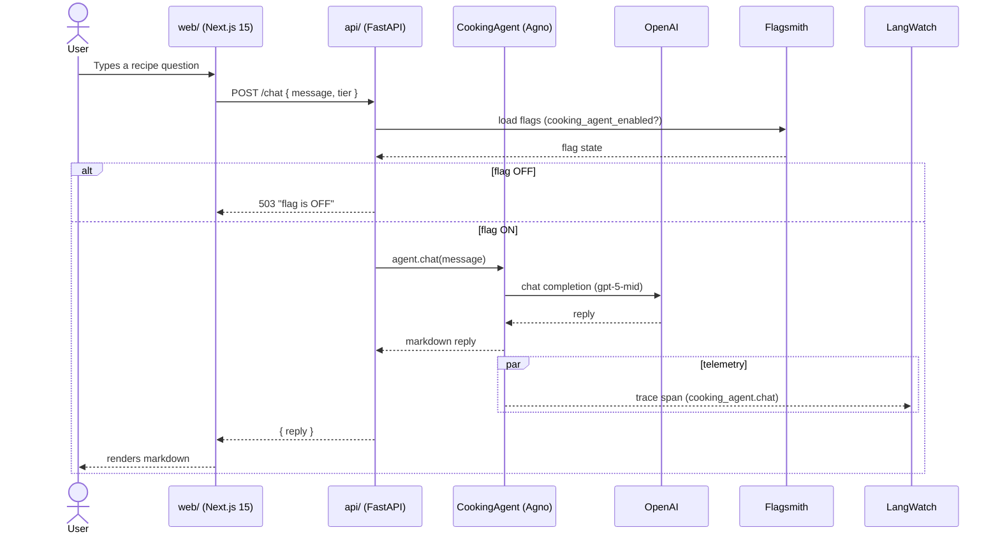
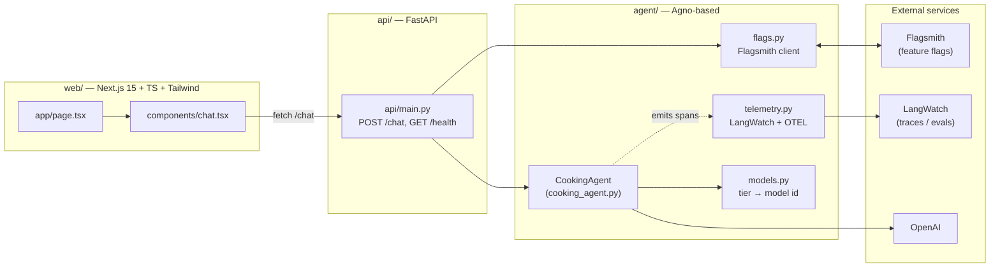
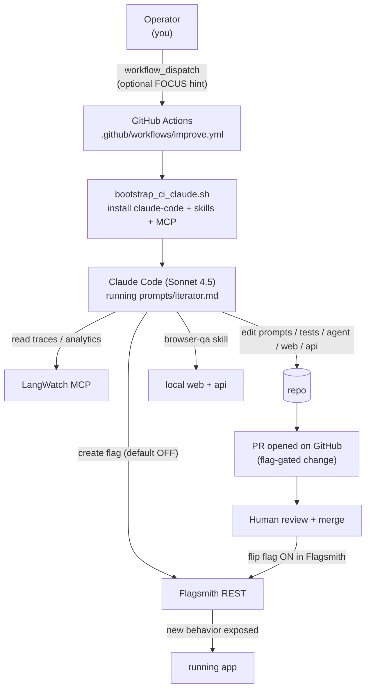

# Architecture (v0.3)

## Runtime flow — a user asks for a recipe



## Component map



## Self-improvement loop (CI)



## What lives where

| Path | Purpose |
|---|---|
| `agent/cooking_agent.py` | Core Agno agent + system prompt |
| `agent/models.py` | Model tier → model id map (cheap / mid / premium) |
| `agent/flags.py` | Flagsmith client + typed `Flags` dataclass |
| `agent/telemetry.py` | LangWatch + OpenInference Agno instrumentor |
| `agent/__main__.py` | `python -m agent chat "…"` CLI entrypoint |
| `api/main.py` | FastAPI backend — the UI's only contact with the agent |
| `web/app/` | Next.js App Router pages + global styles |
| `web/components/chat.tsx` | Chat UI (markdown render, tier selector, error states) |
| `tests/` | langwatch-scenario agent tests (pytest `-m agent_test`) |
| `prompts/iterator.md` | The self-improvement prompt Claude Code executes in CI |
| `.github/workflows/improve.yml` | Workflow_dispatch trigger for the iterator |
| `.github/workflows/scenarios.yml` | Per-PR scenario evaluation gate |
| `scripts/bootstrap_ci_claude.sh` | Idempotent CI bootstrap for Claude Code + MCP |

## How to run locally

```bash
pip install -e ".[dev]"
make api                         # terminal 1 — FastAPI on :8000
cd web && npm install && npm run dev   # terminal 2 — Next.js on :3000
open http://localhost:3000
```

Secrets expected (in `.env` or shell):
- `OPENAI_API_KEY`
- `LANGWATCH_API_KEY`
- `FLAGSMITH_ENVIRONMENT_KEY`

Secrets expected in GitHub Actions (for the iterator):
- `CLAUDE_CODE_OAUTH_TOKEN` (Max subscription, no API billing)
- `FLAGSMITH_API_TOKEN` (management / admin token)
- same three as above
